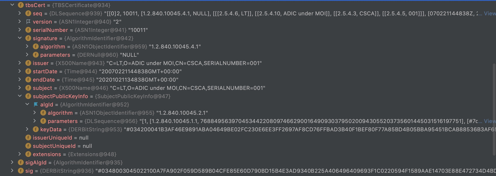

# ePassport cell data

## Requirement

- JDK 1.8

## Source File
- docs/ldif files download from ``` https://download.pkd.icao.int/```。
- masterList downloads from ```https://www.icao.int/Security/FAL/PKD/Pages/ICAO-Master-List.aspx```。

## Data Struct

- cerfiticate fields


- issuer fields explain
  C = country,
  O = organization,
  OU = organizational unit,
  CN = common name
  SERIALNUMBER = serial number.

## Dependency

- [ASN.1](https://zh.wikipedia.org/wiki/ASN.1)
- [CountryCode](https://zh.wikipedia.org/wiki/ISO_3166-1)
- [Public Key Infrastructure Certificate](https://tools.ietf.org/html/rfc5280#section-4.1.1.2)
- [Doc 9303 part 12](https://www.icao.int/publications/Documents/9303_p12_cons_zh.pdf)
